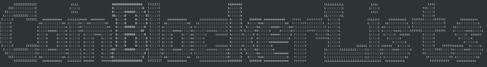

# CoinBlockerLists (Archive)

This repository is an archived copy of the original CoinBlockerLists project, which provided filter lists to block cryptocurrency mining in browsers and other applications.

## Project Status

> **Note:** The original project has been discontinued by its creator. This archive exists to preserve the lists for those who found them useful. No active maintenance or updates are provided.

The original maintainer [announced](https://zerodot1.gitlab.io/CoinBlockerListsWeb/info.txt) the indefinite suspension of the project in 2024 due to health reasons and insufficient community support. This repository preserves the last available version of these lists for historical and reference purposes.

## About CoinBlockerLists

CoinBlockerLists were simple filter lists designed to prevent cryptomining in browsers and other applications. These lists can be used with various blocking software including browser extensions, firewalls, and network-level filtering.

## Usage

These lists can be imported into various content blockers, firewalls, and DNS filtering solutions. Please refer to your specific application's documentation for instructions on how to import blocklists.

## License

The original project was released under GPLv3 license, and this archive maintains that license.

## Contributing

While this is primarily an archive, issues and pull requests that improve the documentation or fix problems with the lists are welcome.

## Original Project Information

- Original repository: https://gitlab.com/ZeroDot1/CoinBlockerLists
- Original website: https://zerodot1.gitlab.io/CoinBlockerListsWeb/
- Original creator: ZeroDot1

## References

For more information about mining protection and related resources, see the [references page](https://zerodot1.gitlab.io/CoinBlockerListsWeb/references.html).
